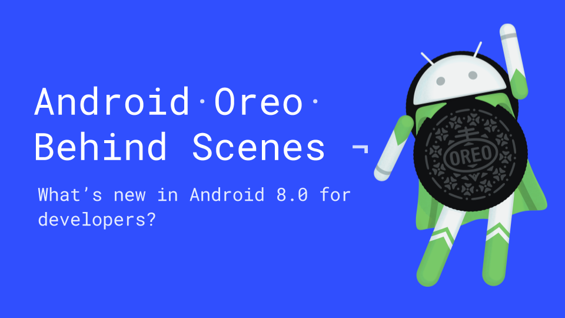

# What’s new in Android 8.0 for developers?  (work-in-progress 👷🔧️👷‍♀️⛏)

Project Goal
---------------------------
The main goal show the most relevant features of android oreo.

List of Samples contained on the Project
----------------------------------------
- [Fonts in XML](https://developer.android.com/guide/topics/ui/look-and-feel/fonts-in-xml.html)
- [Emoji Compatibility](https://developer.android.com/guide/topics/ui/look-and-feel/emoji-compat.html)
- [Autosizing textview](https://developer.android.com/guide/topics/ui/look-and-feel/autosizing-textview.html)
- [Adaptive icons](https://developer.android.com/guide/practices/ui_guidelines/icon_design_adaptive.html)

Do you want to contribute?
--------------------------
Feel free to report or add any useful feature, I will be glad to improve it with your help, before submitting your code please check the [codestyle](https://github.com/square/java-code-styles).

Code style
--------------------------

This project uses [ktlint](https://github.com/shyiko/ktlint), provided via
the [spotless](https://github.com/diffplug/spotless) gradle plugin, and the bundled project IntelliJ codestyle.

If you find that one of your pull reviews does not pass the CI server check due to a code style conflict, you can
easily fix it by running: `./gradlew spotlessApply`, or running IntelliJ/Android Studio's code formatter.

Developed By
------------

* Erik Jhordan Rey  - <erikcaffrey10@gmail.com> o <erik.gonzalez@schibsted.com.mx>

License
-------

    Copyright 2017 Erik Jhordan Rey

    Licensed under the Apache License, Version 2.0 (the "License");
    you may not use this file except in compliance with the License.
    You may obtain a copy of the License at

       http://www.apache.org/licenses/LICENSE-2.0

    Unless required by applicable law or agreed to in writing, software
    distributed under the License is distributed on an "AS IS" BASIS,
    WITHOUT WARRANTIES OR CONDITIONS OF ANY KIND, either express or implied.
    See the License for the specific language governing permissions and
    limitations under the License.
